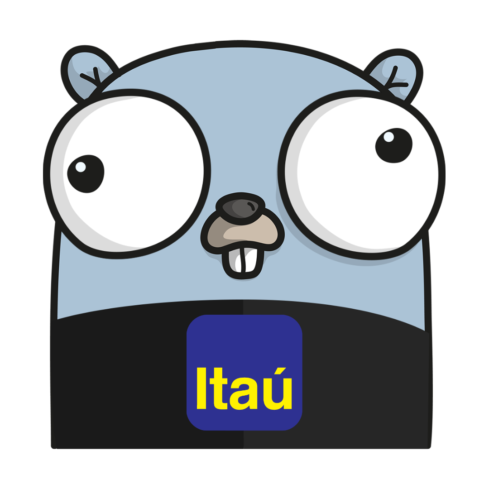

# ✨✨✨ Go Release - 1.21.0 ✨✨✨

## Releases

| Versão do Go | Lançamento        |
|--------------|-------------------|
| 1.18         | Fevereiro de 2022 |
| 1.19         | Agosto de 2022    |
| 1.20         | Fevereiro de 2023 |
| 1.21         | Agosto de 2023    |

## Como funcionam as releases?

- ✅ Lançadas a cada 6️⃣ meses
    - Novas Features
    - Mudanças na Linguagem
- ✅ Versão minor com correções a cada 3️⃣ meses (Fevereiro e Agosto)
    - Corecao de bugs
    - Performance improvements
- ✅ Cada lançamento principal do Go é suportado até que existam dois lançamentos principais mais recentes
    - Exemplo, o Go 1.5 foi suportado até o lançamento do Go 1.7, e o Go 1.6 foi suportado até o lançamento do Go 1.8.

## Como instalar?
- Linux
  - asdf
- Windows
  - manual

Referencias:
- https://golang.org/doc/devel/release.html
- https://medium.com/gitconnected/go-1-21-lets-me-update-for-you-with-exciting-new-libraries-280414c71b81