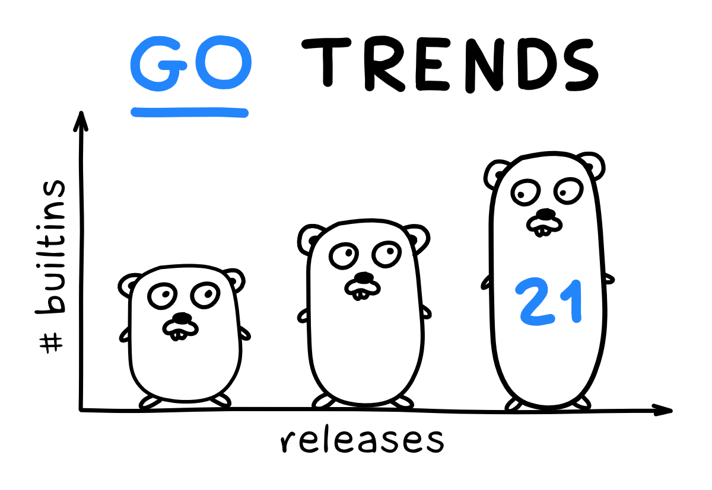

# ✨✨✨ Go Release - 1.21.0 ✨✨✨

* **Melhorias nas ferramentas:**
    * A otimização orientada por perfil (PGO) agora está disponível para o público.
    * A ferramenta `go` agora suporta compatibilidade de linguagem para frente e para trás.
* **Mudanças na linguagem:**
    * Novas funções internas: `min`, `max` e `clear`.
    * Várias melhorias na inferência de tipos para funções genéricas.
    * Uma prévia da captura de variáveis de loop está disponível.
* **Adições à biblioteca padrão:**
    * Novo pacote `log/slog` para registro estruturado.
    * Novo pacote `slices` para operações comuns em fatias de qualquer tipo de elemento.
    * Novo pacote `maps` para operações comuns em mapas de qualquer tipo de chave ou elemento.
    * Novo pacote `cmp` com novas ferramentas para comparar valores ordenados.
* **Melhoria no desempenho:**
    * O compilador Go foi reconstruído com PGO habilitado, resultando em compilações 2-4% mais rápidas.
    * O garbage collector foi ajustado, resultando em uma redução de até 40% na tail latency.
    * Coletar traces com `runtime/trace` agora incorre em um custo de CPU substancialmente menor no amd64 e arm64.
* **Nova porte para WASI:**
    * O Go 1.21 adiciona uma porta experimental para a Interface de Sistema WebAssembly (WASI), Visualização 1.
    * O compilador também suporta uma nova diretiva para importar funções do host Wasm: `go:wasmimport`.
